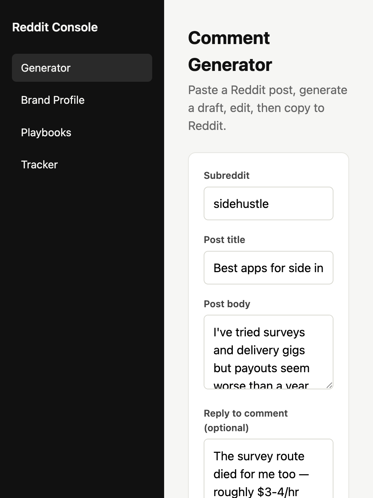

# Reddit Comment Console

Open-source operator tool for Reddit engagement: research subreddits, draft authentic comments with AI, review before posting, and track results.

Built for growth marketers, founders, and agencies who want a **human-in-the-loop** workflow — not a blind auto-spam bot.



```bash
git clone https://github.com/Seeking-Leverage/reddit-comment-bot.git
cd reddit-comment-bot
./scripts/dev.sh
# → http://localhost:5173
```

## The problem

Posting on Reddit at scale is hard:

- Every subreddit has different culture and rules
- Generic AI comments get spotted and downvoted
- Automation without review risks bans and brand damage
- Hard to tie comments back to campaign results

## What this does

```
Brand brief → Subreddit playbooks → Find a post → Generate draft → Human review → Post → Track
```

| Step | Tool |
|------|------|
| Set brand context | **Brand Profile** page |
| Encode subreddit culture | **Playbooks** (tone, angles, dos/donts) |
| Capture a live post | **Generator** — paste title + body |
| Draft a comment | AI generation via any OpenAI-compatible API |
| Review & post | Edit in UI, copy, post manually on Reddit |
| Measure results | **Tracker** — upvotes, impressions, installs vs goals |

Optional **CLI** can auto-scan subreddits and dry-run/post via the Reddit API.

## Quick start

### Prerequisites

- Python 3.9+
- Node.js 18+
- An API key from any [OpenAI-compatible](#llm-providers) LLM provider

### 1. Install

```bash
python -m venv .venv
source .venv/bin/activate   # Windows: .venv\Scripts\activate
pip install -e .

cp .env.example .env
# Add LLM_API_KEY

./scripts/setup-data.sh   # optional: seed brand + playbooks examples

cd web && npm install && cd ..
```

### 2. Run

**Dev (hot reload):**
```bash
./scripts/dev.sh
```
Open **http://localhost:5173**

**Single URL (production-style):**
```bash
cd web && npm run build && cd ..
reddit-api
```
Open **http://127.0.0.1:8000**

### 3. First session

1. **Brand** — fill product, expertise, campaign goals (or run `./scripts/setup-data.sh`)
2. **Playbooks** — add target subreddits (e.g. `sidehustle`)
3. **Generator** — paste a real Reddit post, generate, edit, copy
4. **History** — review saved drafts and posted comments
5. **Tracker** — log metrics after posting

Data saves locally in `data/*.json`. Secrets stay in `.env` (never committed).

## Fork per project

Clone a fresh copy for each brand or campaign:

```bash
git clone https://github.com/Seeking-Leverage/reddit-comment-bot.git acme-reddit
cd acme-reddit
# configure .env + brand/playbooks — no shared infra needed
```

## LLM providers

Uses the OpenAI Python SDK against any **OpenAI-compatible** chat API:

| Provider | `LLM_BASE_URL` | Example `LLM_MODEL` |
|----------|----------------|---------------------|
| OpenAI | *(unset)* | `gpt-4o-mini` |
| OpenRouter | `https://openrouter.ai/api/v1` | `anthropic/claude-3-5-haiku` |
| Groq | `https://api.groq.com/openai/v1` | `llama-3.3-70b-versatile` |
| Azure OpenAI | your deployment URL | your deployment name |

Legacy `OPENAI_*` env vars still work.

## API

| Method | Path | Description |
|--------|------|-------------|
| GET | `/api/health` | Health check |
| GET/PUT | `/api/brand` | Brand profile |
| GET/PUT | `/api/playbooks` | Subreddit playbooks |
| POST | `/api/generate-comment` | Generate comment draft |
| GET/POST | `/api/history` | Comment history |
| GET | `/api/tracker` | Tracker summary |
| PUT | `/api/tracker/goals` | Campaign goals |
| POST | `/api/tracker/entries` | Log metrics |

## CLI (optional)

For automated subreddit scanning and dry-run/live posting:

```bash
cp config/clients/example-client.yaml config/clients/my-project.yaml
# Add Reddit script-app credentials

reddit-bot validate my-project
reddit-bot run my-project           # dry run
reddit-bot run my-project --live    # posts for real
```

Requires a [Reddit script app](https://www.reddit.com/prefs/apps).

## Project structure

```
web/                 React console (Vite + TypeScript)
src/api/             FastAPI backend + JSON storage
src/bot/             Reddit scanner + CLI
data/                Local data (gitignored)
config/clients/      YAML for CLI only
scripts/dev.sh       Start API + web together
```

## Known limitations

- **Human posting only** — the web UI does not auto-post to Reddit
- **Tracker** — manual metric entry; no AppsFlyer/Reddit API integration yet
- **No API auth** — intended for localhost; add auth before exposing publicly
- **Dual config** — web uses `data/*.json`, CLI uses `config/clients/*.yaml` (not synced)

See [CONTRIBUTING.md](CONTRIBUTING.md) to help improve any of the above.

## Responsible use

Reddit engagement must be authentic and transparent. Before using this tool:

1. Read Reddit's [Responsible Builder Policy](https://support.reddithelp.com/hc/en-us/articles/42728983564564-Responsible-Builder-Policy) and [API terms](https://support.reddithelp.com/hc/en-us/articles/16160319875092-Reddit-Data-API-Wiki)
2. **Always review** generated comments before posting
3. Start with low volume; never misrepresent who you are
4. Disclose affiliations when mentioning your product
5. Respect subreddit rules and moderators

This project is a drafting and workflow tool. You are responsible for how it is used.

## Contributing

See [CONTRIBUTING.md](CONTRIBUTING.md). Run `pytest -q` and `cd web && npm run build` before opening a PR.

## License

[MIT](LICENSE)